# COMP2042 Software Maintanance Coursework

Name: Seow Yong Tao\
StudentID: 20317754

Below are the high level view for my maintenance and extension activities,
***for more details of every move, please refer to the file named "GitRelated"***

Key Changes for refactoring activities
---

### 1. Separate "Exit Button" and "Start Button" from HomeMenu

Initially , the HomeMenu class has more than one responsibilities, which has violated the single responsibility principle,
so I decided to refactor it by splitting it into 3 classes (HomeMenu, StartButton, ExitButton) which each only has one responsibility.

After the splitting, HomeMenu class only acts as a container for the buttons,
instead of setting up the properties for the buttons and performing all the behavioral logics for the buttons

### 2. Clearing out the responsibilities from Wall

Initially, there are a lot of responsibilities for Wall class, which has violated the single responsibility principle.
So I decided to refactor the Wall class so that it is only responsible for creating objects for the relevant game components.

Below are my steps to clear out Wall's responsibilities.
1. Move out Ball’s related responsibilities from Wall class to Ball class.

2. Move out Paddle's related responsibilities from Wall class to Paddle class.

3. Create a new class ImpactManager and move out all the impact related logics from Wall class to it.

4. Create a new class LevelManager and move out all the level related logics from Wall class to it.

5. Create a new class BrickCount and move out all the brick count related logics from Wall class to it.

### 3. Refactor HomeMenu, DebugConsole, Wall to follow MVC pattern.

By using MVC pattern, each of the classes have their own responsibility and become less dependent on each other.
With that being said, a modification in a class won't easily affect the other classes.

HomeMenuView: Act as a container for relevant components in home menu\
HomeMenuController: Responsible for creating the behaviours/logics for home menu's components

DebugConsoleView: Act as a container for relevant components in debug console\
DebugConsoleController: Responsible for creating logics for the components in DebugConsoleView to perform action
to interact with relevant data models such as Ball and Bricks

WallView: Responsible for creating relevant objects like ball, player, brick for drawing purposes.\
WallController: Responsible for creating logics for the relevant model objects like ball, player, bricks, brickCount
to interact with each other and updating their states according to relevant events.

Additions/Extensions
---

### 1. Add background image to home menu

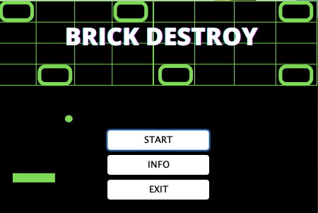

### 2. Add info page

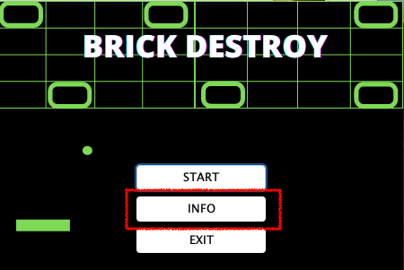

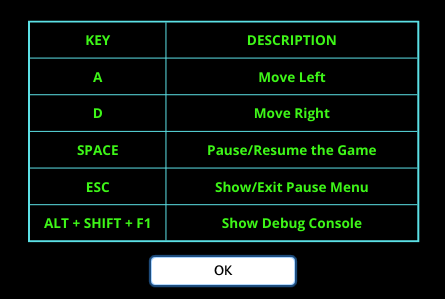

### 3. Add night mode feature

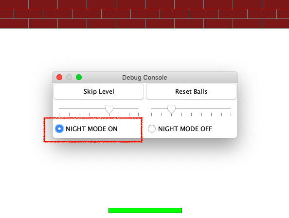

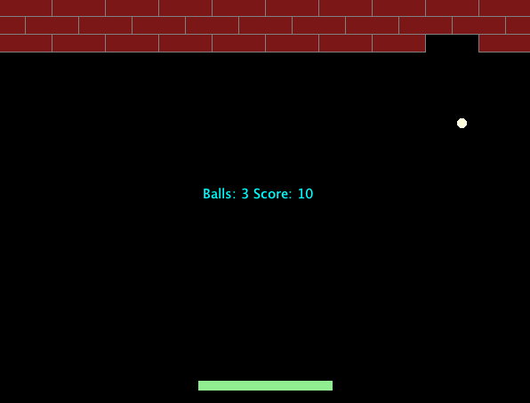

### 4. Add rules to reward and penalize player

i) If a brick is destroyed, 10 scores will be rewarded

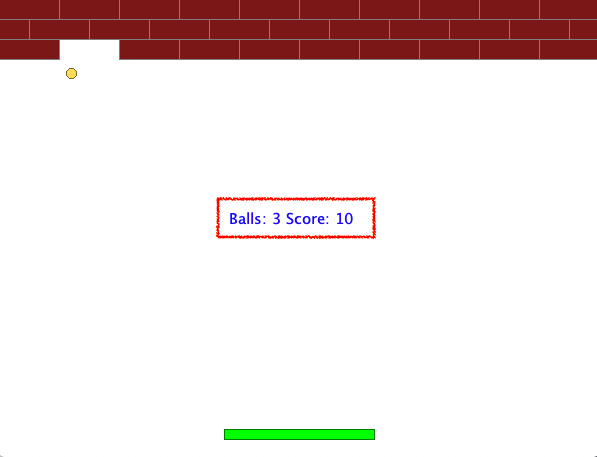

ii) If a ball is lost, 10 scores will be deducted as a penalty.

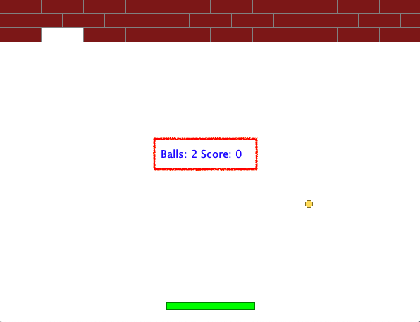

iii) If the user completes the level without losing a ball, extra 30 scores will be rewarded

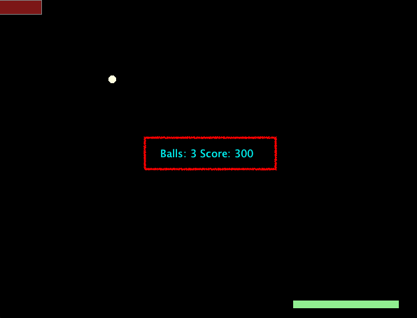

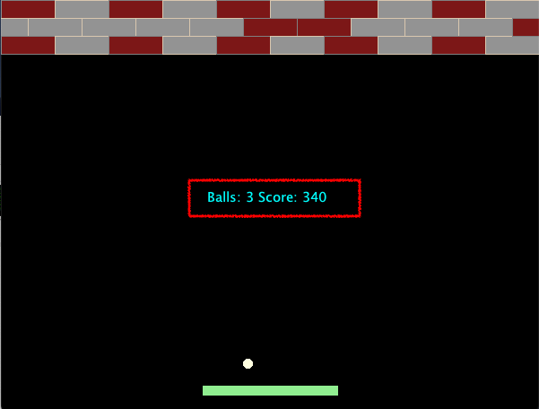

iv) The paddle will become shorter if the ball is lost

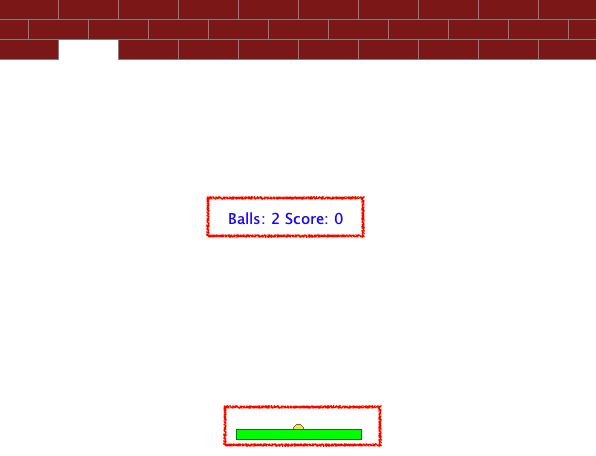

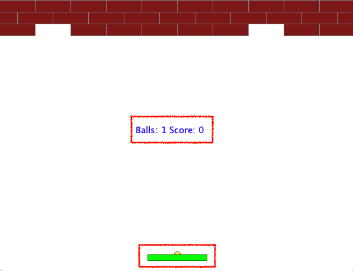

### 5. Add additional levels

Level 5: Add 2 blocks in the wall, and set the ball’s speed to fast speed

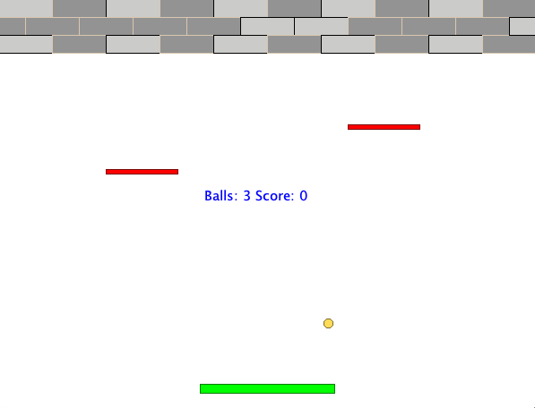

Level 6: The 2 blocks in the wall will move automatically, and set the ball’s speed to fast speed

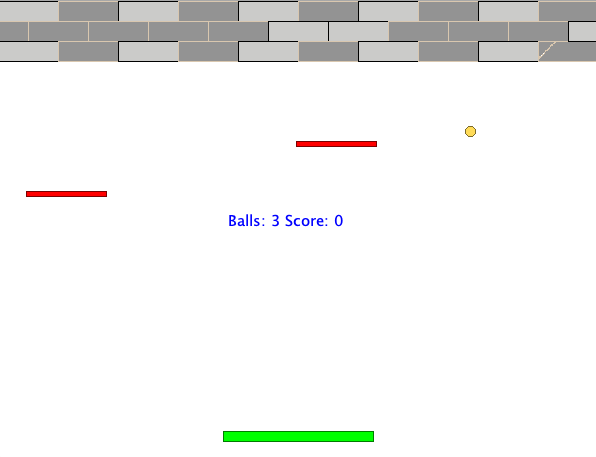

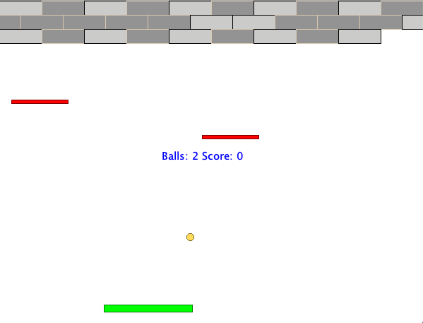

### 6. Add permanent high score list

High score list will be showed under 2 situtions:

1. When the game is over.
2. When the user completes all the level.

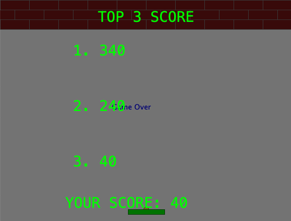

Game Control
---

KEY  | DESCRIPTION
------------- | -------------
A  | Move Left
D  | Move Right
SPACE | Pause/Resume the game
ESC | Show/Exit pause menu
ALT + SHIFT + F1 | Show Debug Console
